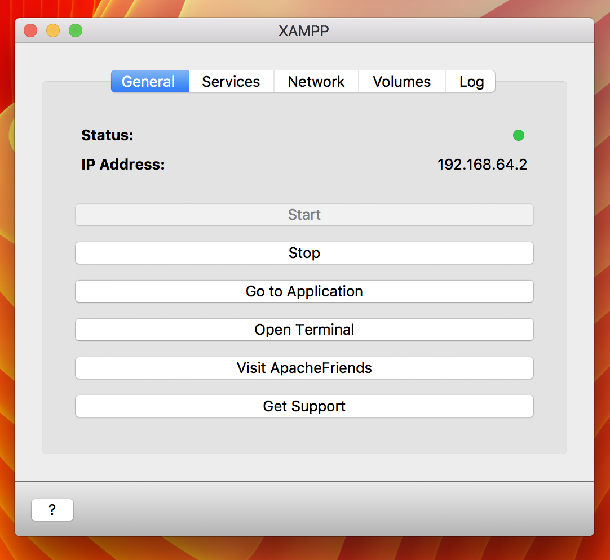
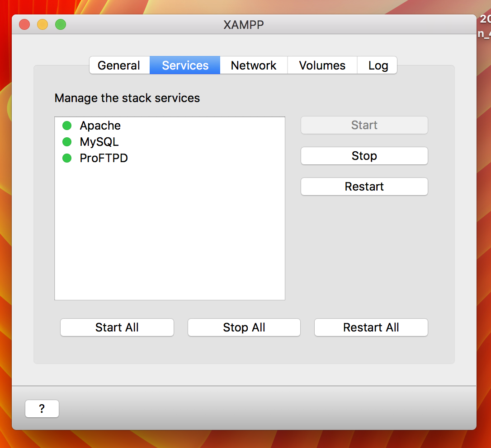
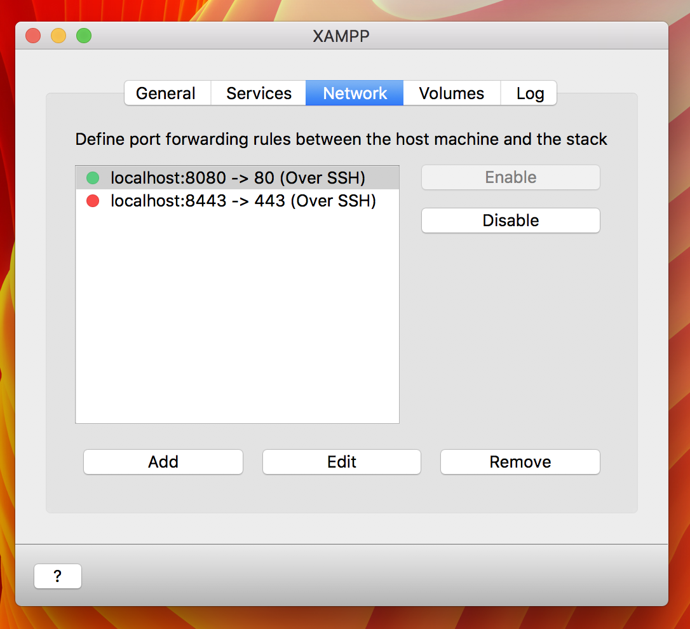
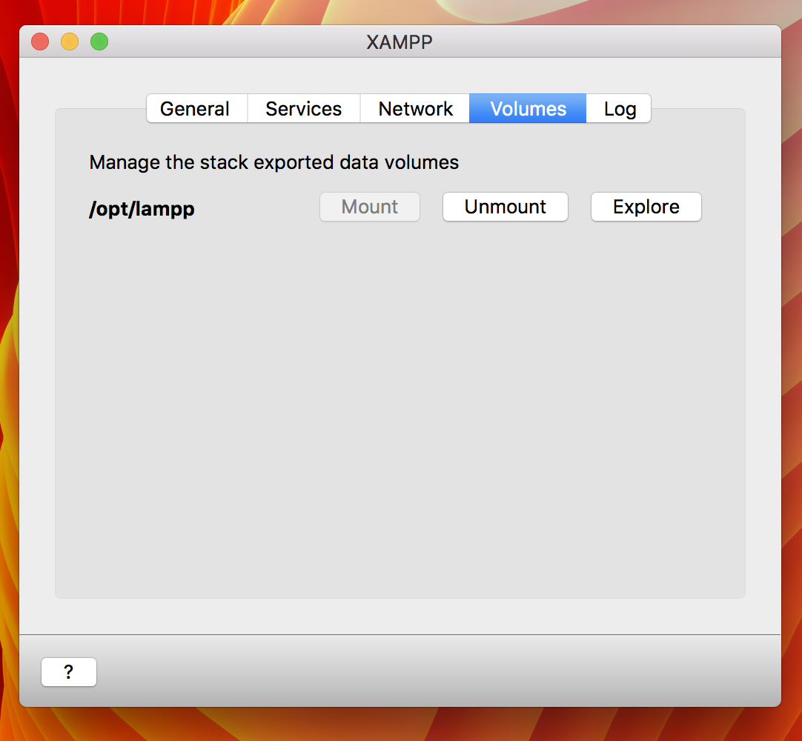

# Tech/Apps/Etc. Stack

## XAMPP

XAMPP is used for stack management.

### Mount your server
"Start" XAMPP:

Make sure all the services are online. If they aren't, start them:

Make sure `:8080` port forwarding is active:

#### Mount `lampp` volume

Mount the `/opt/lampp` volume:

