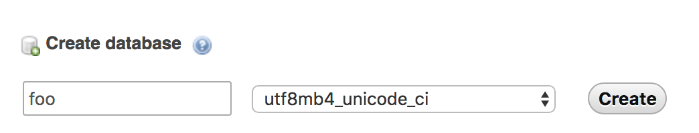

# Wordpress

## Local Dev: Create a new WP site

1. **Start XAMPP:** [Make sure XAMPP is running](stack.md?id=xampp).
1. **Create a new database via PHPMyAdmin:** With XAMPP running, navigate to PHPMyAdmin (most likely at  http://localhost:8080/phpmyadmin/index.php, but you can also find it by clicking the "Go to Application" button in XAMPP's "General" tab — in the top right corner of the resulting webpage, click "PHPMyAdmin").

  Create a new database, for example `foo` (or whatever the name of the project is):

  > 

  In the "Privileges" tab, create a new user (name the user after your project, for example `foo_user`) and check the box to grant it all permissions.

2. **Create a folder in XAMPP's `htdocs`:**

  [With the `lampp` volume mounted](stack.md?id=mount-lampp-volume), create a new folder for your project in `htdocs`.

  (`/Users/thinktank/.bitnami/YOURUSERNAME/machines/xampp/volumes/root/htdocs`)

  will become

  (`/Users/thinktank/.bitnami/YOURUSERNAME/machines/xampp/volumes/root/htdocs/foo`).
3. **Download WordPress:** Download a fresh Wordpress installation from [WordPress.Org](https://wordpress.org/download/). Put it in the new folder you created.
4. **Edit WordPress' Config:** Edit the default WordPress config file, `wp-config-sample.php`:
  - Enter the config from the database you created in PHPMyAdmin:

  ```
  // ** MySQL settings - You can get this info from your web host ** //
  /** The name of the database for WordPress */
  define('DB_NAME', 'foo');

  /** MySQL database username */
  define('DB_USER', 'foo_user');

  /** MySQL database password */
  define('DB_PASSWORD', 'foo_password');

  /** MySQL hostname */
  define('DB_HOST', 'localhost');

  /** Database Charset to use in creating database tables. */
  define('DB_CHARSET', 'utf8mb4');

  /** The Database Collate type. Don't change this if in doubt. */
  define('DB_COLLATE', '');
  ```
  Note: the `utf8mb4` seems to be WordPress's default.

  - Copy/paste the security things from the link in the comments.
  - Change the filename to remove `sample` so it's just `wp-config.php`.
  - add snippet to `wp-config.php` to make custom plugins work.


6. Change the permissions of the site's root directory so you can upload stuff:
`chmod -R 757 foo`

## Local Dev: Pull down existing WP site

You can use WordPress' handy Duplicator plugin to export a copy of a WP site's database and files, and use that export to populate a local site with content (or vice versa).

1. Go to the site (staging) you want to copy and go to Admin > Plugins > Duplicator (`/wp-admin/admin.php?page=duplicator`).
2. Click the "Installer" and "Archive" buttons.
4. Follow the instructions for [Local Dev: Create a new WP site](http://localhost:3000/#/wordpress?id=local-dev-create-a-new-wp-site) above and name everything after the name of the project, including a new database with user and password.
3. Place the downloaded files in your local docroot/project folder. No need to replace the database in PHPMyAdmin, just go to the installer/duplicator page at `localhost:8080/project-name/installer.php` and follow the prompt. Click "Test Database" before you click "Next" on the Install Database step. Leave optional options untouched. You will have to set permissions as in step 6 above.
4. Log in to the Admin interface using the logins from the server.
5. Click the green link at the top of the page to remove the installer files.

## Theming

### Getting your templates to show up

Template hierarchy: https://developer.wordpress.org/themes/basics/template-hierarchy/
