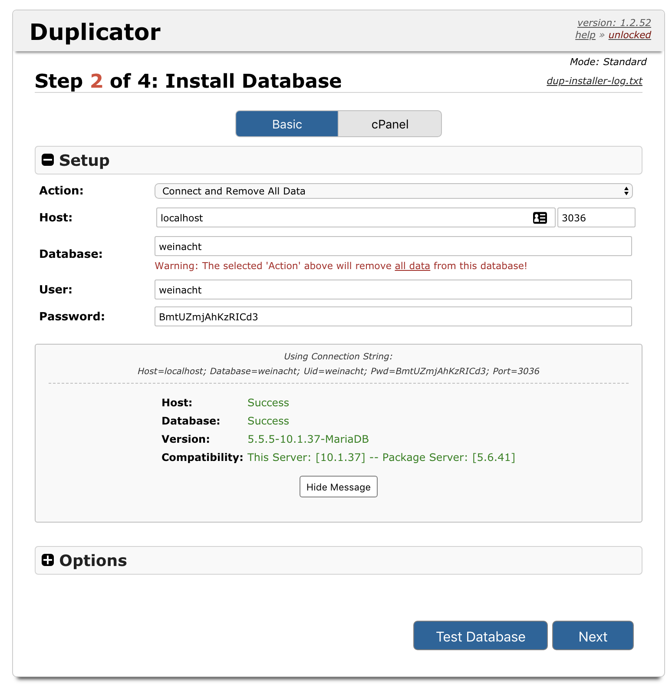

## Local/Staging Workflow

### Create a new WP site

#### (XAMPP version 7.x.x)

> Note: we may want to use XAMPP-vm in the future, but for right now while projects are active/demanding and changes need to be made quickly, just download regular ol' XAMPP, not XAMPP-vm.

1. **Start XAMPP:** [Make sure XAMPP is running](stack.md?id=xampp).
1. **Create a new database via PHPMyAdmin:** With XAMPP running, navigate to PHPMyAdmin (most likely at  http://localhost:8080/phpmyadmin/index.php, but you can also find it by clicking the "Go to Application" button in XAMPP's "General" tab — in the top right corner of the resulting webpage, click "PHPMyAdmin").

  Create a new database, for example `foo` (or whatever the name of the project is):

  > 

  In the "Privileges" tab, create a new user (name the user after your project, for example `foo_user`) and check the box to grant it all permissions.

2. **Create a folder in XAMPP's `htdocs`:**

  [With the `lampp` volume mounted](stack.md?id=mount-lampp-volume), create a new folder for your project in `htdocs`.

  (`/Applications/XAMPP/xamppfiles/htdocs`)

  will become

  (` /Applications/XAMPP/xamppfiles/htdocs/foo`).
3. **Download WordPress:** Download a fresh Wordpress installation from [WordPress.Org](https://wordpress.org/download/). Put it in the new folder you created.
4. **Edit WordPress' Config:** Edit the default WordPress config file, `wp-config-sample.php`:
  - Enter the config from the database you created in PHPMyAdmin:

  ```
  // ** MySQL settings - You can get this info from your web host ** //
  /** The name of the database for WordPress */
  define('DB_NAME', 'foo');

  /** MySQL database username */
  define('DB_USER', 'foo_user');

  /** MySQL database password */
  define('DB_PASSWORD', 'foo_password');

  /** MySQL hostname */
  define('DB_HOST', 'localhost');

  /** Database Charset to use in creating database tables. */
  define('DB_CHARSET', 'utf8mb4');

  /** The Database Collate type. Don't change this if in doubt. */
  define('DB_COLLATE', '');
  ```
  Note: the `utf8mb4` seems to be WordPress's default.

  - Copy/paste the security things from the link in the comments.
  - Change the filename to remove `sample` so it's just `wp-config.php`.
  - add snippet to `wp-config.php` to make custom plugins work.


6. Change the permissions of the site's root directory so you can upload stuff:
`chmod -R 757 foo`

7. Visit the site at http://localhost/foo

#### (XAMPP version 5.x.x)

Start the Things
In the browser, go to `localhost` and the PHPMyAdmin link should work
The location for the `htdocs` is `/Applications/XAMPP/xamppfiles/htdocs`

### Pull down existing WP site

You can use WordPress' handy Duplicator plugin to export a copy of a WP site's database and files, and use that export to populate a local site with content (or vice versa).

1. Go to the site (staging) you want to copy and go to Admin > Plugins > Duplicator (`/wp-admin/admin.php?page=duplicator`).
2. Click the "Installer" and "Archive" buttons.
4. Follow the instructions for [Local Dev: Create a new WP site](http://localhost:3000/#/wordpress?id=local-dev-create-a-new-wp-site) above and name everything after the name of the project, including a new database with user and password.
3. Place the downloaded files in your local docroot/project folder. No need to replace the database in PHPMyAdmin, just go to the installer/duplicator page at `localhost:8080/project-name/installer.php` and follow the prompt. Click "Test Database" before you click "Next" on the Install Database step. Leave optional options untouched. You will have to set permissions as in step 6 above.
> 

4. Log in to the Admin interface using the logins from the server.
5. Click the green link at the top of the page to remove the installer files.
6. Some of the images might not work due to routing issues.

## Staging Sites

Staging sites are hosted on our local in-office server, accessible from within the office at `192.168.0.253`. Credentials on Basecamp [here](https://3.basecamp.com/3593713/buckets/1887887/uploads/1543763349). Current workflow: import the `xml` file from Basecamp into FileZilla and then access the imported saved connected via `File > Site Manager`.

Staging sites have names like `foo-com.thinktankprm.com` and live at `/var/www/html/foo-com.thinktankprm.com`.

## Theming

### Starter themes

There is a starter theme on the server in `Web > starter`

### Creating a new theme

https://developer.wordpress.org/themes/basics/

Copy the `twentyseventeen` theme directory...?

Make sure it has a `.css` file.

### Getting your templates to show up

Template hierarchy: https://developer.wordpress.org/themes/basics/template-hierarchy/

## Plugins

- Custom field thing
- Really Simple SSL plugin

## Google Analytics

I've been doing this by adding the GA code to `functions.php`; not sure how was doing it. There are a few plugins to handle this, but it's unclear which is the better method. https://www.wpbeginner.com/beginners-guide/how-to-install-google-analytics-in-wordpress/ (That page says adding it via plugin is the best method, but adding it in the code seems cleaner? Downside: theme dependent)

Add the following to `functions.php` in the active theme directory:

```
function ns_google_analytics() { ?>
  <script async src="https://www.googletagmanager.com/gtag/js?id=UA-121810903-1"></script>
  <script>
    window.dataLayer = window.dataLayer || [];
    function gtag(){dataLayer.push(arguments);}
    gtag('js', new Date());
    gtag('config', 'YOUR-TRACKING-CODE-FROM-GOOGLE-ANALYTICS');
  </script>
  <?php
  }

add_action( 'wp_head', 'ns_google_analytics', 10 );
```

## Hosting

### If a client needs hosting

Recommend to clients:
- HostGator or GoDaddy or similar

## To Launch

Someone will (on the client side, but you may have to):

- sign up for hosting
- point the DNS to the hosting

### HostGator

#### Existing WordPress Site via HostGator WordPress package

1. Go to Hosting > Manage package

1. On your local machine, set hosts file entry to the new site IP from the host `sudo nano /etc/hosts`. This is so you can run the installer at `wp-installer.php` on the destination (live) site.

1. Create a FTP account on the hosting account site. Add the account username/password/etc. to the `logins` file on the ThinkTank Clients server for that project.

1. Use your FTP client (or CPanel) to upload the site files to the host in `/`

1. Download `wp-config.php` from the existing codebase and open it to get the Database settings (if they have an exisiting blank WP install through purchasing a WordPress package, otherwise you can use PHPMyAdmin or some other way to get to the database).

1. Get rid of the existing codebase.

1. Using Duplicator (admin > Duplicator), export the staging site and files. Click the Installer and Archive buttons, or use One-Click Download.

1. Paste the downloaded files from Duplicator in the live site directory.

1. Go through the Duplicator prompt at `/install.php`.

1. Tell whoever's pointing the DNS to point the DNS after you've checked out the site and it looks good.

1. Turn on the "Really Simple SSL plugin"

1. Let Trish and Kevin know that the site is uploaded.

### Adding a custom post type

Use https://generatewp.com/ to generate a custom post type. Paste it into `functions.php` in the theme directory.
